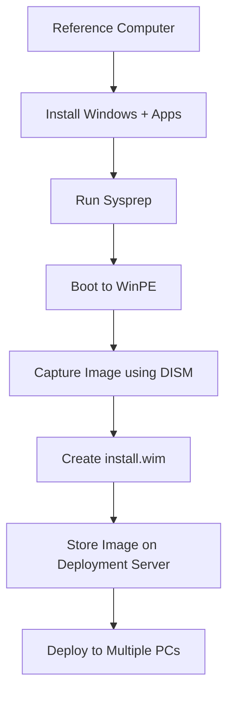
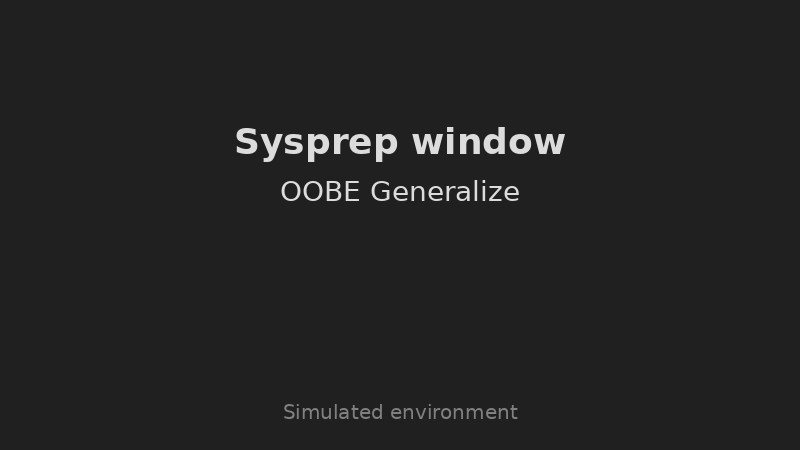
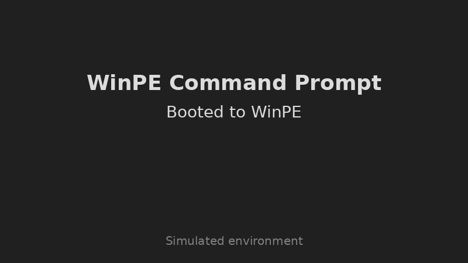
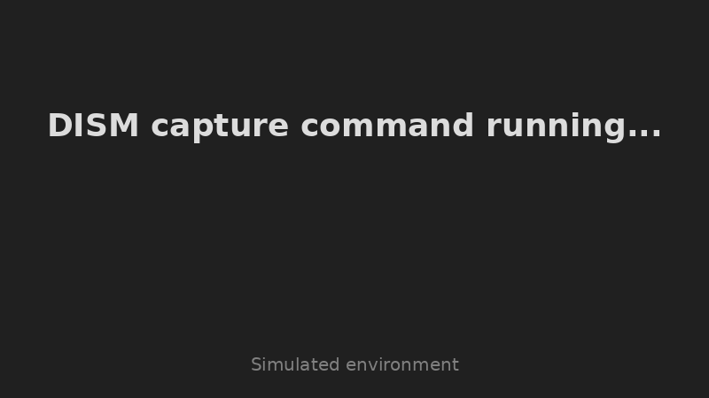
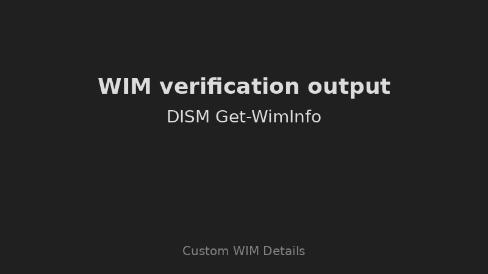

# Windows Image Capture Using DISM Boot Environment

This repository provides a self‑contained walkthrough for **capturing a Windows operating system image** using Microsoft’s **Deployment Image Servicing and Management (DISM)** tool from a **Windows Preinstallation Environment (WinPE)** boot media.  Capturing a customised Windows image is an essential task for system administrators who need to deploy multiple computers with identical software stacks.  By following the steps in this project you will prepare a reference installation, capture it into a `.wim` file and store it ready for deployment.

## 🧭 Why this project?

Enterprises and IT teams often need to deploy hundreds or thousands of machines with the same OS, drivers and applications.  Manually installing Windows and configuring each machine is time‑consuming and error prone.  Using DISM from a boot environment allows you to capture a **golden image** of a fully configured Windows installation and then redeploy it consistently across your environment.  This project simulates a real enterprise imaging workflow and demonstrates the underlying commands used by tools such as **Microsoft Deployment Toolkit (MDT)** and **Windows Deployment Services (WDS)**.

## 📦 Repository structure

```
dism-image-capture-project/
├── README.md                     – this documentation
├── diagrams/
│   └── architecture.mmd          – Mermaid definition of the imaging workflow
├── scripts/
│   └── dism_capture_example.cmd – example Windows batch file for capturing an image
├── screenshots/                  – simulated screenshots for the workflow
└── (optional) your own screenshots
```

### diagrams/architecture.mmd
Contains a [Mermaid](https://mermaid.js.org/) flowchart describing the stages of capturing a Windows image.  GitHub will automatically render this diagram when you view the file online.

### scripts/dism_capture_example.cmd
A simple batch script that runs a `dism` capture command.  You can modify the script to match your environment (e.g. update drive letters or image names) before using it in your WinPE session.

### screenshots/
This folder holds **simulated images** illustrating the major steps in the process.  They are placeholders created for this project; when you perform the steps yourself you can replace them with real screen captures.

## 🛠️ Prerequisites

Before starting you will need:

1. **Hardware/VM**
   - A reference computer or virtual machine running Windows 10 or Windows 11 to act as the source image.
   - An external drive or network share to store the captured `.wim` file.
   - A USB flash drive (8 GiB or larger) to create the WinPE boot media.

2. **Software**
   - [Windows Assessment and Deployment Kit (ADK)](https://learn.microsoft.com/windows-hardware/get-started/adk-install) for your version of Windows.  During installation select **Deployment Tools**.
   - [WinPE Add‑on](https://learn.microsoft.com/windows-hardware/get-started/adk-install#winpe-add-ons) for the ADK so you can build bootable WinPE media.

3. **Knowledge**
   - Familiarity with basic Windows command line usage and disk management.
   - Administrative permissions on the reference computer.

## 🧑‍💻 Step‑by‑step guide

These steps assume you are running on a Windows machine with the ADK and WinPE add‑on installed.  Replace drive letters (e.g. `C:` and `D:`) with those that match your environment.

### 1 – Install Windows ADK and WinPE

Download and install the Windows ADK.  During setup select **Deployment Tools** and, if prompted, include **User State Migration Tool (USMT)**.  After ADK installation, download and install the **WinPE add‑on**.

### 2 – Create a WinPE boot USB

Open the **Deployment and Imaging Tools Environment** (a Start menu entry installed with ADK) as an administrator and run:

```bash
# Copy the WinPE files for 64‑bit (amd64) systems
copype amd64 C:\WinPE

# Create a bootable USB from the WinPE files
MakeWinPEMedia /UFD C:\WinPE F:
```

Replace `F:` with the drive letter of your USB flash drive.  This command formats the USB and copies the WinPE files onto it.

### 3 – Prepare the reference system

On your reference computer or VM:

1. Install Windows and configure the region, language and licensing.
2. Install all required device drivers.
3. Apply the latest Windows updates.
4. Install and configure applications (e.g. Microsoft Office, web browsers, monitoring tools).
5. Customise system settings, wallpaper, power options and network configuration.

This machine will become your **golden image**.  Do not join the domain or install software that is unique to a single user.

### 4 – Generalise the installation with Sysprep

To remove machine‑specific information and prepare the installation for imaging, run **Sysprep**:

```bash
%SystemRoot%\System32\Sysprep\sysprep.exe
```

Select the following options in the Sysprep GUI:

- **System Cleanup Action:** *Enter System Out‑of‑Box Experience (OOBE)*.
- **Generalize** (tick the box).
- **Shutdown Options:** *Shutdown*.

Sysprep will remove unique SIDs and reset the system, then automatically shut down the computer.

### 5 – Boot into WinPE

Insert the WinPE USB and boot the reference computer from it.  If necessary, configure the BIOS/UEFI boot order.  When WinPE loads you will see a command prompt.

### 6 – Identify the volumes

Use **DISKPART** to list the available volumes and identify the drive letters assigned to the Windows partition and the destination drive (USB or network share):

```batch
diskpart
list volume
exit
```

Take note of the drive letter of your Windows partition (often `C:`) and the drive or network share where you want to save the image (e.g. `D:`).  You can map a network share in WinPE using `net use` if needed.

### 7 – Capture the image using DISM

Run the following command in WinPE to create a **Windows Imaging Format (.wim)** file.  Replace `C:` with your Windows partition and `D:\install.wim` with the destination path for the image.

```batch
dism /capture-image ^
    /imagefile:D:\install.wim ^
    /capturedir:C:\ ^
    /name:"Windows10-Custom" ^
    /description:"Custom Windows 10 image captured on 2026-03-12" ^
    /compress:max ^
    /checkintegrity
```

Parameters explained:

| Parameter       | Explanation                                                          |
|-----------------|----------------------------------------------------------------------|
| `/capture-image`| Tells DISM to capture a new image                                    |
| `/imagefile`    | Destination `.wim` file (specify a path on your USB or network share)|
| `/capturedir`   | Root directory of the Windows partition to capture                   |
| `/name`         | Friendly name for the image within the WIM archive                   |
| `/description`  | Optional description text stored inside the image header             |
| `/compress`     | Compression type; `max` yields the smallest file size                |
| `/checkintegrity`| Verifies the integrity of the resulting image after capture         |

The capture process may take several minutes.  When finished you will have `install.wim` on your destination drive.

### 8 – Verify the captured image

You can verify the details of the captured `.wim` file using:

```batch
dism /get-wiminfo /wimfile:D:\install.wim
```

This command displays image metadata such as the name, description, architecture, size and the number of images within the WIM.

### 9 – Store and deploy the image

Copy the `install.wim` file to a deployment server or network share where you can use it with tools such as **WDS**, **MDT** or a PXE boot server.  During deployment you can replace the default `install.wim` on Windows installation media with your custom image to install a fully configured system on target machines.

## 🔁 Example batch script

The file [`scripts/dism_capture_example.cmd`](scripts/dism_capture_example.cmd) contains a minimal batch script you can adapt for use in WinPE.  It encapsulates the commands for enumerating volumes and capturing the image, allowing for an unattended imaging process.

```batch
@echo off
REM Example DISM capture script

echo Listing volumes...
diskpart /s "%~dp0list_volumes.txt"

echo Capturing Windows image to install.wim...
dism /capture-image /imagefile:D:\install.wim /capturedir:C:\ /name:"Windows10-Custom" /compress:max /checkintegrity

echo Image capture complete.
```

You can create a text file `list_volumes.txt` in the same folder with the `list volume` command if you wish to automate the disk part listing.

## 📊 Architecture diagram

The following Mermaid diagram illustrates the high‑level workflow of capturing a Windows image using DISM.  To view the rendered diagram on GitHub, open [diagrams/architecture.mmd](diagrams/architecture.mmd).



## 🖼️ Screenshots

The `screenshots/` folder contains simulated images illustrating key steps in the imaging process. These images are not actual screen captures from Windows but serve as placeholders to help visualise the workflow. When you run through the lab yourself you can replace them with your own screen captures.

| Step                                  | Image |
|---------------------------------------|-------|
| Sysprep window and generalize options |  |
| Booting into the WinPE command prompt |  |
| Running the DISM capture command      |  |
| Verifying the captured WIM image      |  |

## 📝 Notes and tips

- Always test your captured image on a non‑production machine before widespread deployment.
- Keep your reference system up to date before capturing to reduce the number of updates required on deployed machines.
- Use descriptive names and descriptions when capturing multiple images into the same `.wim` file.
- If you need to capture additional partitions (e.g. recovery partitions), run separate `dism` commands for each partition or use the `/capture-image` command recursively.
- For more advanced scenarios (e.g. injecting drivers or updates into the image) refer to the [official DISM documentation](https://learn.microsoft.com/windows-hardware/manufacture/desktop/deploy-a-windows-image-using-a-script) and MDT guides.

## 🪪 License

This project is released under the MIT License.  See the LICENSE file for details.
